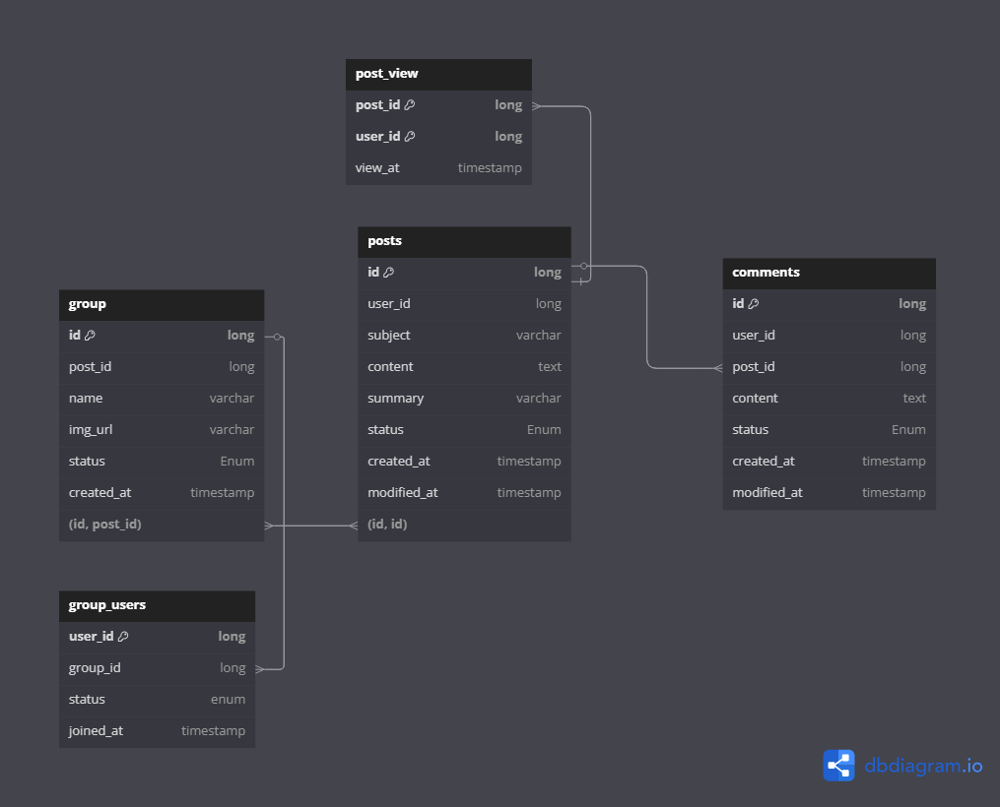

# 게시글 서비스
게시판과 게시판 그룹을 담당합니다.
# 테이블 구조

## 테이블 설명
### post
게시글 제목과 본문
### post_view
게시글 조회자
### comments
게시글 댓글
### group
게시글 저장 위치(카테고리 또는 분류 역할)를 나타낸다.  
또한 사용자들마다 개인 그룹이 존재한다.
### group_users
group에 속한 유저

## 실행 환경
- openJdk 17

# 설정 파일
## application-prod
운영환경에서 사용되는 설정 파일

## application-dev
로컬환경에서 사용되는 설정 파일로 커밋 금지

## application-test
빌드전 테스트를 위한 설정 파일
